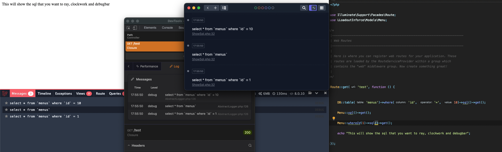

# Laravel showsql

A Laravel package to output a specific sql to your favourite debugging tool, your browser or your log file.

## Use case

You often want to draw the attention and look into one single sql while you are developing.  You can look up your sql in your favourite debugging
tool in the sql tab , but most of the time your sql is not the only sql executed ... So the searching begins.  With this package you can
add `showSql()` to your QueryBuilder and the single sql will be outputted to the logging of your debug tool.

The supported log output is Laravel Telescope, Laravel Log, Ray, Clockwork, Laravel Debugbar and your browser.  By default, showSql will try to
log to Ray, Clockwork or the Laravel Debugbar if one of them is installed.  If all installed it will be output to all.
If you want your own log implementation you can pass a callback to showSql.

If you want to change this behaviour you can publish the config file and change it.

## Compability

This package can be installed in Laravel 6,7,8 and 9

## Installation 

```shell
composer require dietercoopman/laravel-showsql --dev
```

## Examples 

```php 
# With the Eloquent Builder

Menu::showSql()->get();

Menu::whereId(1)->showSql()->get();

Menu::whereHas('status')->showSql()->get();

# With the Query Builder

DB::table('menus')->where('id', '=', 10)->showSql()->get();

DB::table('menus')->join('statuses', 'statuses.id', '=', 'menus.status_id')
                 ->showSql()
                 ->get();

# With a callback 

$callback = function(string $sql){
  Log::info($sql);
};

DB::table('products')->where('id', '=', 1)->showSql($callback)->get();
```

## This is an example log output



## Configuration

You can publish the config file with the following command

```shell
php artisan vendor:publish --tag=showsql-config 
```

Laravel showsql is default configured to output to ray,clockwork and laravel debugbar.  If you want to change this you can do it in the published config file.

```php

return [
    'to' => [
        'telescope' => false,
        'ray' => true,
        'clockwork' => true,
        'debugbar' => true,
        'log' => false,
        'browser' => false,
    ]
];

```

## Why is this not available in the core of Laravel ?

I've created a pull request to the framework that has been declined.  It adds too much extra logic to the framework itself.
The queries as generated in this code are actual not the real statements as passed to your database engines.  The real sql never lives 
in the framework.  The query and bindings are passed separately to the database engine and constructed there.  So there might be
some edge cases. [You can see my pull request here](https://github.com/laravel/framework/pull/39053)

## Changelog

Please see [CHANGELOG](CHANGELOG.md) for more information on what has changed recently.

## Contributing

Please see [CONTRIBUTING](.github/CONTRIBUTING.md) for details.

## Security Vulnerabilities

Please review [our security policy](../../security/policy) on how to report security vulnerabilities.

## Credits

- [Dieter Coopman](https://github.com/dietercoopman)
- [All Contributors](../../contributors)

## License

The MIT License (MIT). Please see [License File](LICENSE.md) for more information.
