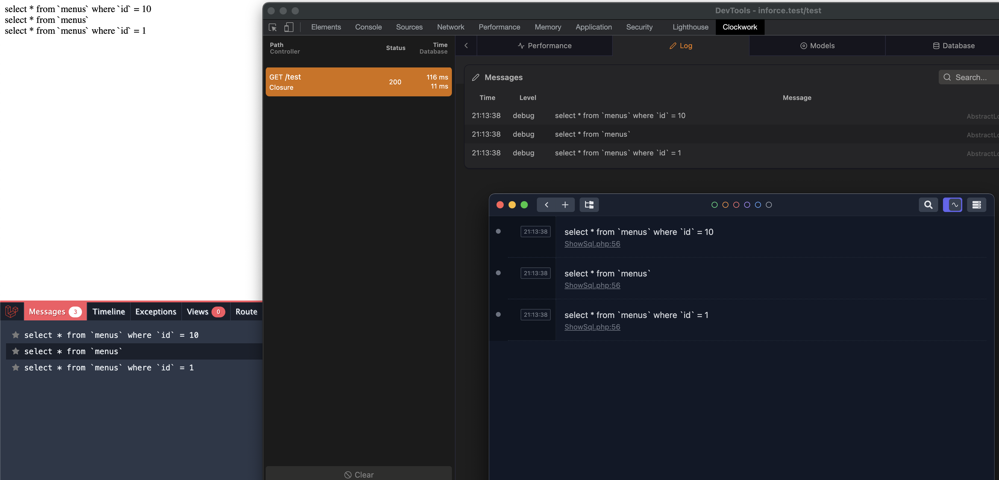

# A Laravel package to log the current sql to your favourite debug tool

## Use case

You often want to draw the attention and look into one single sql while you are developing.  You can lookup your sql in your favourite debugging tool in the sql tab , but most of the time your sql is not the only sql executed ... So the searching begins.  With this package you can add `showSql()` to your QueryBuilder and the single sql will be outputted to the logging of your debug tool.

This works with ray , clockwork and debugbar 

## Examples 

```php 

    DB::table('menus')->where('id', '=', 10)->showSql()->get();

    Menu::showSql()->get();

    Menu::whereId(1)->showSql()->get();
```



## Changelog

Please see [CHANGELOG](CHANGELOG.md) for more information on what has changed recently.

## Contributing

Please see [CONTRIBUTING](.github/CONTRIBUTING.md) for details.

## Security Vulnerabilities

Please review [our security policy](../../security/policy) on how to report security vulnerabilities.

## Credits

- [Dieter Coopman](https://github.com/dietercoopman)
- [All Contributors](../../contributors)

## License

The MIT License (MIT). Please see [License File](LICENSE.md) for more information.
